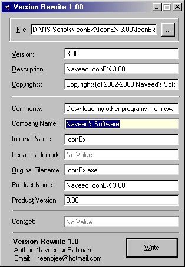



## Edit "Version Informations" of Files \(e\.g\. Author, Description,Copyrights, Trademarks and many more\)

### Description

Edit the version informations of file. The codes are so easy and that you can add many more properties to the program. Just a few minutes are required to understand the codes and thats all. You can see its preview. Please vote for me.
 
### More Info
 

             |
---                |---
**Submitted On**   |2002-11-03 11:25:02
**By**             |[Naveed ur Rahman](https://github.com/Planet-Source-Code/PSCIndex/blob/master/ByAuthor/naveed-ur-rahman.md)
**Level**          |Advanced
**User Rating**    |5.0 (10 globes from 2 users)
**Compatibility**  |VB 6\.0
**Category**       |[Coding Standards](https://github.com/Planet-Source-Code/PSCIndex/blob/master/ByCategory/coding-standards__1-43.md)
**World**          |[Visual Basic](https://github.com/Planet-Source-Code/PSCIndex/blob/master/ByWorld/visual-basic.md)
**Archive File**   |[Edit\_\_Vers1491361132002\.zip](https://github.com/Planet-Source-Code/naveed-ur-rahman-edit-version-informations-of-files-e-g-author-description-copyrights-trad__1-40376/archive/master.zip)

